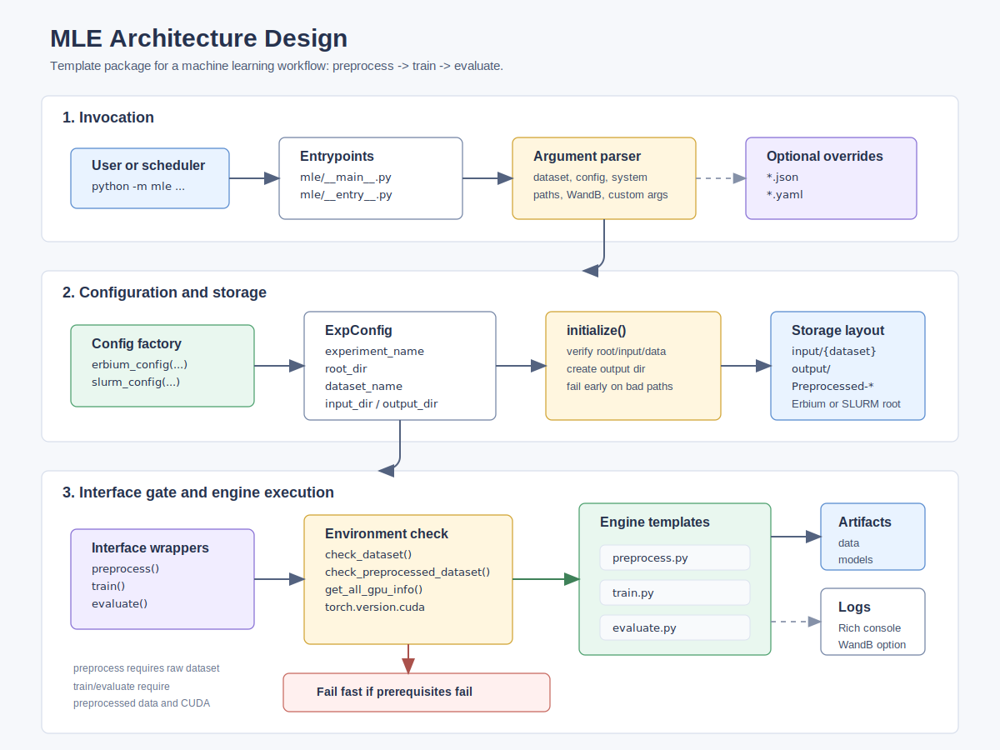

# Machine Learning Engineer



MLE is a machine learning engineer that reproduces a paper, trains a model, or fine-tunes a model for you with a single
prompt like: "I want to train ConvNeXt on the CIFAR-10 dataset".

## Getting Started

This codebase is a template codebase for a general machine learning workflow to apply a model onto a dataset:
preprocess $\to$ train $\to$ infer $\to$ evaluate. Before actually running experiments, you need to fork or clone this
repository. Then, install the [skill](SKILL.md) and let an agent implement the engine.

For example, suppose we want to fine-tune MedGemma 1.5 on the FLARE-MLLM-2D dataset:

> Fine-tune MedGemma 1.5 (https://huggingface.co/google/medgemma-1.5-4b-it) on the FLARE-MLLM-2D
> dataset (https://huggingface.co/datasets/FLARE-MedFM/FLARE-MLLM-2D). For evaluation, please report:
> 
> - Balanced accuracy for the disease diagnostic classification
> - Mean Absolute Error (MAE) for cell counting
> - F1 score matching via IoU > 0.5 for detection
> - F1 score for multi-label classification
> - Mean absolute error (MAE) for regression
> - GREEN score for report generation
>
> For the GREEN score computation, use the implementation in https://github.com/ATATC/GREEN.

[This](https://github.com/ATATC/MedGemma-FLARE-2D) repository is the example here.

## Usage

### Local

The commands are the same as on Erbium, but you need to use these flags to specify the paths:

```shell
--root_dir path/to/project/root
--input_dir path/to/input/directory
--output_dir path/to/output/directory
```

Your dataset should be available at "{INPUT_DIR}/{DATASET_NAME}".

### On Erbium

#### Install Your Modified Codebase

If you are working inside a fork of MLE, you can install it directly from GitHub.

```shell
pip install git+https://github.com/your-username/your-forked-repo
```

If you cloned MLE and are working locally, upload the source files to "/workspace/app" and install it from there.

```shell
cd /workspace/app
pip install -e .
```

#### Run Your Modified Codebase

```shell
python -m mle preprocess
```

```shell
python -m mle train --num_epochs=1000 --batch_size=2 --learning_rate=0.0004
```

```shell
python -m mle infer segmentation
```

```shell
python -m mle evaluate segmentation
```

### On SLURM

#### Install Your Modified Codebase

Create a virtual environment and install some critical dependencies first.

```shell
module load python/3.12
module load arrow
module load cuda
virtualenv /scratch/${USER}/venv
source /scratch/${USER}/venv/bin/activate
pip install --no-index --upgrade pip
pip install --no-index simpleitk  # critical dependencies whose wheels for simpleitk are too slow to build
```

Note that unlike Erbium where we reinforce the file structure, you probably need to create the input and output
directories yourself on SLURM clusters.

```shell
mkdir /scratch/${USER}/input
mkdir /scratch/${USER}/output
```

Your dataset should be available at "/scratch/{USER}/{DATASET_NAME}".

If you are working inside a fork of MLE, you can install it directly from GitHub.

```shell
pip install git+https://github.com/your-username/your-forked-repo
```

If you cloned MLE and are working locally, upload the source files to "/scratch/${USER}/app" and install it from there.

```shell
cd /scratch/${USER}/app
pip install -e .
```

#### Run Your Modified Codebase

You can use [DRA-config](https://github.com/ATATC/dra-config) skills to generate the job script or the following
template.

```shell
#!/bin/bash
#SBATCH --job-name=
#SBATCH --account=
#SBATCH --time=
#SBATCH --nodes=1
#SBATCH --ntasks=1
#SBATCH --cpus-per-task=
#SBATCH --mem=
#SBATCH --gpus-per-node=h100:1
#SBATCH --output=%x-%j.out
#SBATCH --error=%x-%j.err

# virtual environment

set -euo pipefail
module --force purge
module load StdEnv/2023 || true
module load python/3.12 || true
module load arrow || true
module load cuda || true

# authentication
...

python -m mle -c slurm -suser ${USER} ...
```

### Custom Arguments

You can have a JSON or YAML file with the arguments you want to pass to the engine.

Suppose you have "path/to/custom-args.yaml", simply add a flag to the command like:

```shell
python -m mle ... --custom_args path/to/custom-args.yaml
```