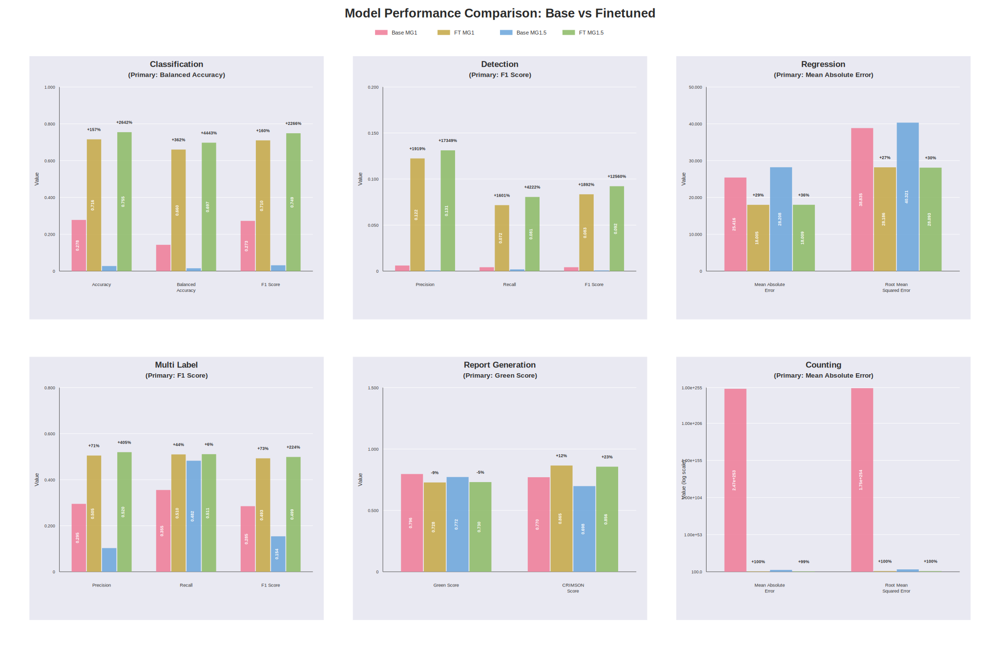

# MedGemma-FLARE-2D

## 🚀 Quick Start

🤗 The full output of this repository, including LoRA weights, inference outputs, and evaluation results, can be found
[here](https://huggingface.co/ATATC/FLARE26-MedGemma).

## Overview

Fine-tuning and evaluation pipeline for MedGemma on FLARE-MLLM-2D.

This repository converts the FLARE-MLLM-2D annotations into MedGemma-style
vision-language SFT rows, fine-tunes MedGemma with LoRA/QLoRA, generates
predictions, and evaluates six task families:

- disease diagnosis classification
- detection
- multi-label classification
- report generation
- regression
- cell counting

## Local Setup

### Requirements

- Python 3.12
- A CUDA GPU for training and full inference
- Hugging Face access to the MedGemma model repositories
- FLARE-MLLM-2D data available locally

The package depends on `torch`, `transformers`, `trl`, `peft`, `bitsandbytes`,
`datasets`, `Pillow`, `wandb`, `green_score`, and `crimson-score`.

### Install

Create an environment and install this repository in editable mode:

```shell
cd /path/to/MedGemma-FLARE-2D
python3.12 -m venv .venv
source .venv/bin/activate
pip install --upgrade pip
pip install -e .
```

Log in to Hugging Face before running training or inference:

```shell
huggingface-cli login
```

For non-interactive runs, set a token instead:

```shell
export HF_TOKEN=...
export HUGGING_FACE_HUB_TOKEN="$HF_TOKEN"
```

### Data Layout

The CLI expects a dataset directory at:

```text
{INPUT_DIR}/{DATASET_NAME}
```

For a fully local run from the repository root, place the dataset here:

```text
input/FLARE-MLLM-2D/
```

Then use these shared variables in the examples below:

```shell
export DATASET_NAME=FLARE-MLLM-2D
export ROOT_DIR="$PWD"
export INPUT_DIR="$PWD/input"
export OUTPUT_DIR="$PWD/output"
export TASKS="classification cell_counting detection multi_label_classification regression report_generation"
```

## Pipeline

All commands below use `--config local` and explicit local paths. The default
local config root is `~/Documents`, so keep `--root_dir`, `--input_dir`, and
`--output_dir` in the command unless you intentionally want different paths.

### 1. Preprocess

Preprocessing converts FLARE-MLLM-2D into JSONL files under
`output/Preprocessed-FLARE-MLLM-2D/` and, when `datasets` is installed, an
Arrow dataset under `output/Preprocessed-FLARE-MLLM-2D/hf_dataset/`.

```shell
python -m mle \
  -d "$DATASET_NAME" \
  --config local \
  --root_dir "$ROOT_DIR" \
  --input_dir "$INPUT_DIR" \
  --output_dir "$OUTPUT_DIR" \
  preprocess
```

Optional preprocessing config:

```yaml
# configs/preprocess.yaml
tasks:
  - disease_diagnosis_classification
  - cell_counting
  - detection
  - multi_label_classification
  - regression
  - report_generation
allow_missing_images: false
include_unanswered: false
no_hf_dataset: false
```

Run with:

```shell
python -m mle \
  -d "$DATASET_NAME" \
  --config local \
  --root_dir "$ROOT_DIR" \
  --input_dir "$INPUT_DIR" \
  --output_dir "$OUTPUT_DIR" \
  --custom_args configs/preprocess.yaml \
  preprocess
```

### 2. Fine-tune MedGemma

Training uses LoRA/QLoRA SFT. Full training requires a CUDA GPU.

Example MedGemma 1.5 config:

```yaml
# configs/train-medgemma15.yaml
model_name_or_path: google/medgemma-1.5-4b-it
precision: auto  # fp16 on Colab T4/V100, bf16 on A100/H100/L4+
image_size: 896
resize_mode: square
max_images_per_sample: 1
gradient_accumulation_steps: 16
max_eval_samples: 256
load_in_4bit: true
lora_rank: 16
lora_alpha: 16
lora_dropout: 0.05
attn_implementation: auto
gradient_checkpointing: true
save_steps: 200
eval_steps: 200
save_total_limit: 3
```

Run fine-tuning:

```shell
python -m mle \
  -n flare-medgemma \
  -d "$DATASET_NAME" \
  --config local \
  --root_dir "$ROOT_DIR" \
  --input_dir "$INPUT_DIR" \
  --output_dir "$OUTPUT_DIR" \
  --custom_args configs/train-medgemma15.yaml \
  train \
  --num_epochs 3 \
  --batch_size 1 \
  --learning_rate 2e-4
```

The final adapter is saved to:

```text
output/flare-medgemma-medgemma15-lora/final/
```

To train MedGemma 1 instead, use the same command with a different experiment
name and model:

```yaml
# configs/train-medgemma1.yaml
model_name_or_path: google/medgemma-4b-it
model_output_dir: output/flare-medgemma1-medgemma1-lora
precision: auto  # fp16 on Colab T4/V100, bf16 on A100/H100/L4+
image_size: 896
resize_mode: square
max_images_per_sample: 1
gradient_accumulation_steps: 16
max_eval_samples: 256
load_in_4bit: true
lora_rank: 16
lora_alpha: 16
lora_dropout: 0.05
attn_implementation: auto
gradient_checkpointing: true
save_steps: 200
eval_steps: 200
save_total_limit: 3
```

```shell
python -m mle \
  -n flare-medgemma1 \
  -d "$DATASET_NAME" \
  --config local \
  --root_dir "$ROOT_DIR" \
  --input_dir "$INPUT_DIR" \
  --output_dir "$OUTPUT_DIR" \
  --custom_args configs/train-medgemma1.yaml \
  train \
  --num_epochs 3 \
  --batch_size 1 \
  --learning_rate 2e-4
```

### 3. Run Inference

Inference writes:

```text
output/{EXPERIMENT_NAME}-infer/{split}_predictions.jsonl
output/{EXPERIMENT_NAME}-infer/inference_details.json
```

Example adapter inference config:

```yaml
# configs/infer-medgemma15.yaml
split: all
model_name_or_path: google/medgemma-1.5-4b-it
image_size: 896
resize_mode: square
max_images_per_sample: 1
batch_size: 1
max_new_tokens: 256
temperature: 0.0
```

Run inference with the fine-tuned adapter:

```shell
python -m mle \
  -n flare-medgemma \
  -d "$DATASET_NAME" \
  --config local \
  --root_dir "$ROOT_DIR" \
  --input_dir "$INPUT_DIR" \
  --output_dir "$OUTPUT_DIR" \
  --custom_args configs/infer-medgemma15.yaml \
  infer \
  $TASKS
```

If your adapter is not at the default location, add it to the inference config:

```yaml
adapter_path: /path/to/adapter/final
```

For MedGemma 1 adapter inference, use the MG1 model and point inference at the
MG1 adapter output directory:

```yaml
# configs/infer-medgemma1.yaml
split: all
model_name_or_path: google/medgemma-4b-it
model_output_dir: output/flare-medgemma1-medgemma1-lora
image_size: 896
resize_mode: square
max_images_per_sample: 1
batch_size: 1
max_new_tokens: 256
temperature: 0.0
```

### 4. Run Base-model Inference

To evaluate an unfine-tuned model, set `base_model: true`.

```yaml
# configs/infer-base-medgemma15.yaml
base_model: true
split: all
model_name_or_path: google/medgemma-1.5-4b-it
image_size: 896
resize_mode: square
max_images_per_sample: 1
batch_size: 1
max_new_tokens: 256
temperature: 0.0
```

```shell
python -m mle \
  -n flare-medgemma-base \
  -d "$DATASET_NAME" \
  --config local \
  --root_dir "$ROOT_DIR" \
  --input_dir "$INPUT_DIR" \
  --output_dir "$OUTPUT_DIR" \
  --custom_args configs/infer-base-medgemma15.yaml \
  infer \
  $TASKS
```

Use the matching MedGemma 1 model name for the MG1 base run:

```yaml
model_name_or_path: google/medgemma-4b-it
```

### 5. Evaluate Predictions

Evaluation reads prediction JSONL files and writes:

```text
output/{EXPERIMENT_NAME}-eval/scores.json
output/{EXPERIMENT_NAME}-eval/details.json
```

Example evaluation config:

```yaml
# configs/evaluate.yaml
split: all
allow_missing_predictions: false
iou_threshold: 0.5
green_model_name: StanfordAIMI/GREEN-radllama2-7b
green_batch_size: 8
green_max_length: 2048
crimson_api: hf
crimson_model_name:
crimson_batch_size: 1
skip_crimson_score: false
```

Evaluate the fine-tuned run:

```shell
python -m mle \
  -n flare-medgemma \
  -d "$DATASET_NAME" \
  --config local \
  --root_dir "$ROOT_DIR" \
  --input_dir "$INPUT_DIR" \
  --output_dir "$OUTPUT_DIR" \
  --custom_args configs/evaluate.yaml \
  evaluate \
  $TASKS
```

Evaluate a base-model run by changing `-n` to the base experiment name:

```shell
python -m mle \
  -n flare-medgemma-base \
  -d "$DATASET_NAME" \
  --config local \
  --root_dir "$ROOT_DIR" \
  --input_dir "$INPUT_DIR" \
  --output_dir "$OUTPUT_DIR" \
  --custom_args configs/evaluate.yaml \
  evaluate \
  $TASKS
```

To evaluate predictions in a non-default directory, add one of these to the
custom args:

```yaml
predictions: /path/to/predictions_dir
# or
predictions:
  testing: /path/to/testing_predictions.jsonl
  validation_public: /path/to/validation_public_predictions.jsonl
  validation_hidden: /path/to/validation_hidden_predictions.jsonl
```

## Smoke Test

Use `--smoke_test` before a full run. It limits preprocessing, training,
inference, and evaluation workloads while keeping the same code paths.

```shell
python -m mle \
  -n smoke-medgemma \
  -d "$DATASET_NAME" \
  --config local \
  --root_dir "$ROOT_DIR" \
  --input_dir "$INPUT_DIR" \
  --output_dir "$PWD/output-smoke" \
  --custom_args configs/train-medgemma15.yaml \
  --smoke_test \
  train \
  --num_epochs 1 \
  --batch_size 1 \
  --learning_rate 2e-4
```

Smoke-mode defaults include tiny sample caps, short generation, and skipped
heavy report scorers unless you explicitly set `skip_green_score: false` or
`skip_crimson_score: false`.

## WandB

Pass `--wandb` to `train`, `infer`, or `evaluate` commands to enable logging.
You can control the project and run names in the YAML config:

```yaml
wandb_project: medgemma-flare-mllm-2d
wandb_run_name: flare-medgemma-local
wandb_mode: online
```

## Plot Results

After the four evaluation directories exist under `output/`, generate the
comparison SVG:

```shell
python scripts/plot_model_performance.py
```

The script reads these defaults:

```text
output/flare-medgemma1-base-eval/scores.json
output/flare-medgemma1-eval/scores.json
output/flare-medgemma-base-eval/scores.json
output/flare-medgemma-eval/scores.json
```

and writes:

```text
output/model_performance_comparison.svg
```

## Output Summary

Typical local artifacts:

```text
output/
  Preprocessed-FLARE-MLLM-2D/
    train.jsonl
    validation.jsonl
    validation_hidden.jsonl
    testing.jsonl
    dataset_info.json
  flare-medgemma-medgemma15-lora/final/
  flare-medgemma-infer/
    testing_predictions.jsonl
    validation_public_predictions.jsonl
    validation_hidden_predictions.jsonl
    inference_details.json
  flare-medgemma-eval/
    scores.json
    details.json
  model_performance_comparison.svg
```

## Performance Notes

### Cross-model Comparison



### Fine-tuning Comparison

| Task                       | Primary Metric                   | Base MG1  | FT MG1   | Improvement             | Base MG1.5 | FT MG1.5 | Improvement       | Winner       |
|----------------------------|----------------------------------|-----------|----------|-------------------------|------------|----------|-------------------|--------------|
| Classification             | Balanced Accuracy $\uparrow$     | 0.1429    | 0.6601   | $\uparrow$ 362%         | 0.0153     | 0.6974   | $\uparrow$ 4458%  | MedGemma 1.5 |
| Detection                  | F1 Score IoU > 0.5 $\uparrow$    | 0.0042    | 0.0834   | $\uparrow$ 1886%        | 0.0007     | 0.0922   | $\uparrow$ 13071% | MedGemma 1.5 |
| Multi-label Classification | F1 Score $\uparrow$              | 0.2849    | 0.4929   | $\uparrow$ 73%          | 0.1541     | 0.4988   | $\uparrow$ 224%   | MedGemma 1.5 |
| Report Generation          | GREEN Score $\uparrow$           | 0.7963    | 0.7275   | $\downarrow$ 9%         | 0.7719     | 0.7305   | $\downarrow$ 5%   | MedGemma 1.5 |
| Regression                 | Mean Absolute Error $\downarrow$ | 2.47E+253 | 18.0047  | $\downarrow$ ~100%      | 28.2077    | 18.0094  | $\downarrow$ 36%  | MedGemma 1   |
| Counting                   | Mean Absolute Error $\downarrow$ | 2.4691    | 303.4800 | $\uparrow$ 12191% error | 32663.9000 | 275.6400 | $\downarrow$ 99%  | MedGemma 1.5 |
| Report Generation          | CRIMSON $\uparrow$               | 0.7963    | 0.8654   | $\uparrow$ 9%           | 0.6978     | 0.8561   | $\uparrow$ 23%    | MedGemma 1   |

## Notes

- Training and full inference should run on a GPU.
- Evaluation itself does not load MedGemma, but GREEN and CRIMSON scoring can
  still be model-heavy.
- Prediction files can be JSONL rows with `uid` and `prediction`, a JSON list
  of such rows, or a JSON object mapping `uid` to prediction text.
